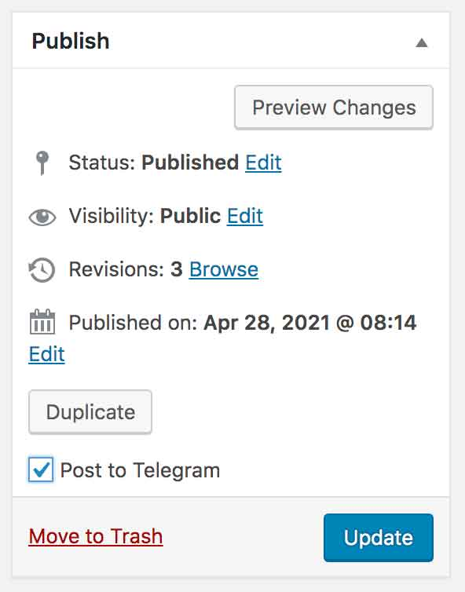
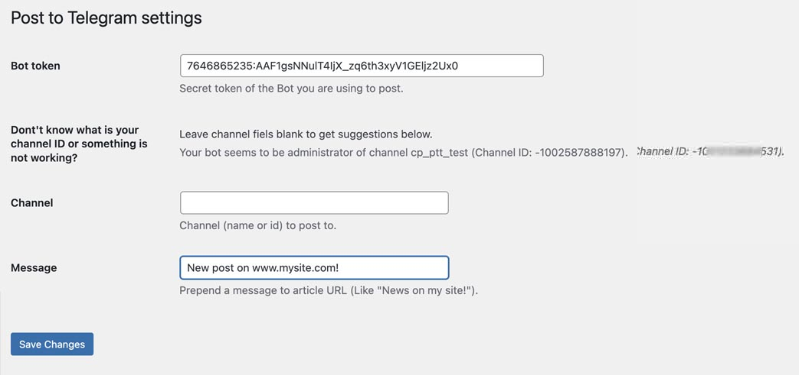

# Post to Telegram

When editing a post, just check a checkbox and when you hit "publish" a link to the post will be sent to your Telegram channel.
If there is one, post the featured image.

This plugin is written for ClassicPress.




## Usage

- Create your channel.
- Create a bot.
- Create a token for the bot
- Go to Settings -> Post to Telegram
- Fill your bot token.
- Fill your channel ID

You can also add a text that will be prepended to the link.

Having troubles finding your channel ID?
Try revoking admin rights to your boot, give it admin rights again, and save the changes leaving Channel field empty.
Maybe some hints will be shown!



## Filters

`ptt_query_params`
 
Change request made to Telegram Bot API.
_Example: adding text to the message_

```php
add_filter( 'ptt_query_params' , 'myprefix_telegram_before_text' , 10 , 3 );

public function myprefix_telegram_before_text( $params, $post_id, $method ) {
	if ( $method === 'sendMessage' ) {
		$params[ 'text' ] = '<b>Nuovo articolo!</b> ' . $params[ 'text' ];
	} else {
		$params[ 'caption' ] = '<b>Nuovo articolo!</b> ' . $params[ 'caption' ];
	}
	return $params;
}
```


### Privacy
**To help us know the number of active installations of this plugin, we collect and store anonymized data when the plugin check in for updates. The date and unique plugin identifier are stored as plain text and the requesting URL is stored as a non-reversible hashed value. This data is stored for up to 28 days.**

